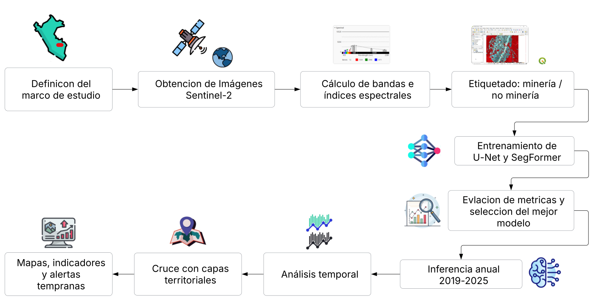
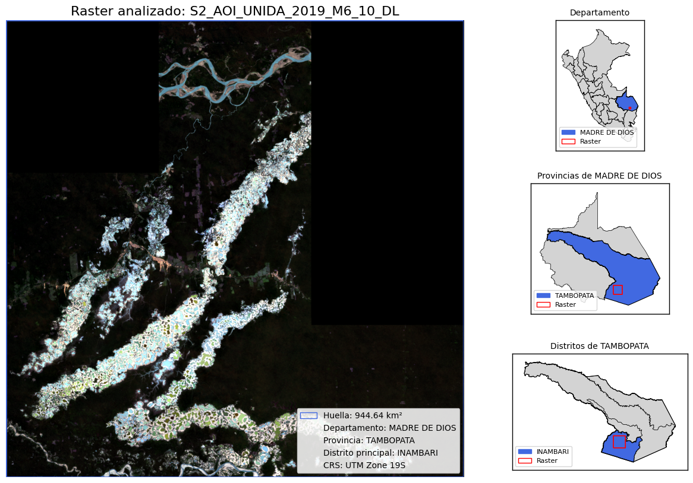
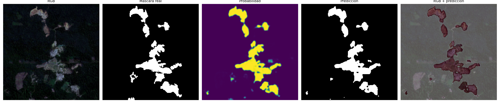
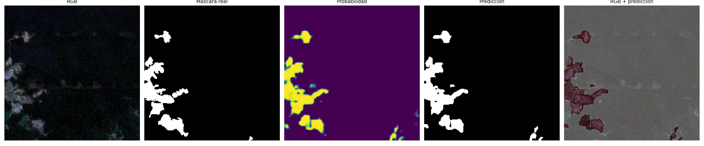

# 🌎Modelos de inteligencia artificial para la detección y monitoreo multitemporal de minería ilegal: caso aplicado en Madre de Dios

Proyecto de **inteligencia artificial, teledetección y análisis geoespacial** para detectar y monitorear la expansión de la minería ilegal usando imágenes Sentinel-2, modelos Deep Learning y datos territoriales.

El caso piloto se desarrolla en **Madre de Dios**, provincia de **Tambopata**, distrito principal de **Inambari**, con un área aproximada de **944.64 km²**. La metodología tiene potencial de **escalabilidad a nivel nacional**.

---

## 📌 Mensaje Central

> 💬 **"La transformación digital no consiste solo en usar tecnología. Consiste en convertir datos en decisiones, evidencia en acción y territorio en prioridad pública."**

---

## 🚀 Objetivo

Explorar modelos de Deep Learnig para detectar, cuantificar y monitorear la degradación del medio donde hay presencia de minería ilegal entre **2019 y 2025**, generando información territorial útil para fiscalización ambiental, alertas tempranas y toma de decisiones públicas.

---

## ⚙️ Flujo metodológico

  

---

## 📍 Área de estudio

| Elemento | Descripción |
|---|---|
| Departamento | Madre de Dios |
| Provincia | Tambopata |
| Distrito principal | Inambari |
| Área aproximada | 944.64 km² |
| CRS | UTM Zone 19S / EPSG:32719 |
| Periodo | 2019–2025 |
### Imagen Sentinel-2

  

---

## 🛰️ Datos utilizados

### Imágenes satelitales

- Sentinel-2
- Periodo: 2019–2025
- Meses priorizados: agosto a octubre

### 🛠️ Insumos y Capas del Sistema

| 🛰️ Bandas (Sentinel-2) | 📈 Índices Espectrales | 🗺️ Capas Territoriales |
| :--- | :--- | :--- |
| **B2** (Azul) | **NDVI** (Vegetación) | Límites administrativos |
| **B3** (Verde) | **NDWI** (Agua) | Áreas naturales protegidas (ANP) |
| **B4** (Rojo) | **MNDWI** (Agua modificado) | Zonas de amortiguamiento |
| **B8** (NIR) | **NBR** (Quemas/Severidad) | Comunidades nativas tituladas |
| **B11** (SWIR 1) | **NDBI** (Áreas Construidas) | Ríos navegables |
| **B12** (SWIR 2) | **BSI** (Suelo Desnudo) | Interoperabilidad GEO Perú / SNIG |
---

## 🧠 Modelos entrenados

| Modelo | Descripción |
|---|---|
| U-Net baseline | Encoder ResNet34, 12 canales de entrada |
| SegFormer-B0 | Modelo principal, adaptado a 12 canales Sentinel-2 + índices |

---

## 📊 Resultados del modelo

| Modelo | IoU | Dice/F1 | Precisión | Recall | Accuracy |
|---|---:|---:|---:|---:|---:|
| U-Net baseline | 0.8574 | 0.9090 | 0.9240 | 0.9189 | 0.9742 |
| SegFormer-B0 | 0.8603 | 0.9115 | 0.9119 | 0.9266 | 0.9756 |

**U-Net: Valiación Visual**

  

**SegFormer-B0: Valiación Visual**

  

**SegFormer-B0** fue seleccionado como modelo principal por su mejor desempeño global.
---

## 📈 Resultados temporales

| Año | Área minera detectada |
|---|---:|
| 2019 | 14,842.70 ha |
| 2020 | 15,422.58 ha |
| 2021 | 16,480.93 ha |
| 2022 | 17,321.73 ha |
| 2023 | 18,624.12 ha |
| 2024 | 20,346.87 ha |
| 2025 | 22,678.36 ha |

### Indicadores principales

- Incremento total: **7,835.66 ha**
- Variación total: **52.79%**
- Expansión nueva 2019–2025: **8,721.05 ha**
- Minería persistente: **13,957.31 ha**
- Huella acumulada: **24,741.49 ha**

### 🎞️ Evolución temporal de la minería detectada

  

  <em>Predicción anual generada con SegFormer-B0 a partir de imágenes Sentinel-2.</em>

---

## 🗺️ Hallazgos territoriales

| Capa territorial | Resultado principal |
|---|---:|
| Zonas de amortiguamiento | 4,233.19 ha de expansión nueva |
| Zonas de amortiguamiento | 15,683.85 ha de minería acumulada |
| Comunidades nativas | 178.37 ha de expansión nueva en Kotsimba |
| Ríos navegables | Presión en Río Manuani e Inambari |
| Áreas naturales protegidas | 9.32 ha de expansión nueva |

---

## 🌐 Escalabilidad

Aunque el piloto se desarrolló en Madre de Dios, la metodología puede escalarse a otras regiones del Perú afectadas por minería ilegal, deforestación o degradación ambiental. 

Para escalar el sistema se requiere:
* **Incorporar nuevas imágenes** provenientes de satélites como Sentinel-2.
* **Generar muestras locales** de entrenamiento adaptadas a la geografía de cada zona.
* **Ajustar o reentrenar el modelo** para asegurar una alta precisión.
* **Integrar capas territoriales** regionales para un mejor contexto geográfico.
* **Automatizar reportes** y la emisión de alertas tempranas.

---

## 🎯 Impacto Esperado

Este proyecto busca contribuir a:
* 🔍 **Mejorar la fiscalización ambiental** a través de tecnología precisa.
* 🚨 **Detectar nuevos frentes** de minería ilegal de manera temprana.
* 🌿 **Reducir riesgos socioambientales** asociados a la degradación del territorio.
* 📍 **Priorizar zonas críticas** para la intervención y control.
* 📊 **Fortalecer la toma de decisiones** en la gestión pública basadas en evidencia.
* 🏛️ **Impulsar la transformación digital** de las instituciones del Estado.

---

## 👤 Autor

* **Wilder Sebastian R.**

> 💡 *Proyecto desarrollado como propuesta para **GEOTÓN Perú 2026**, orientado al uso de datos georreferenciados, inteligencia artificial e innovación pública.*
