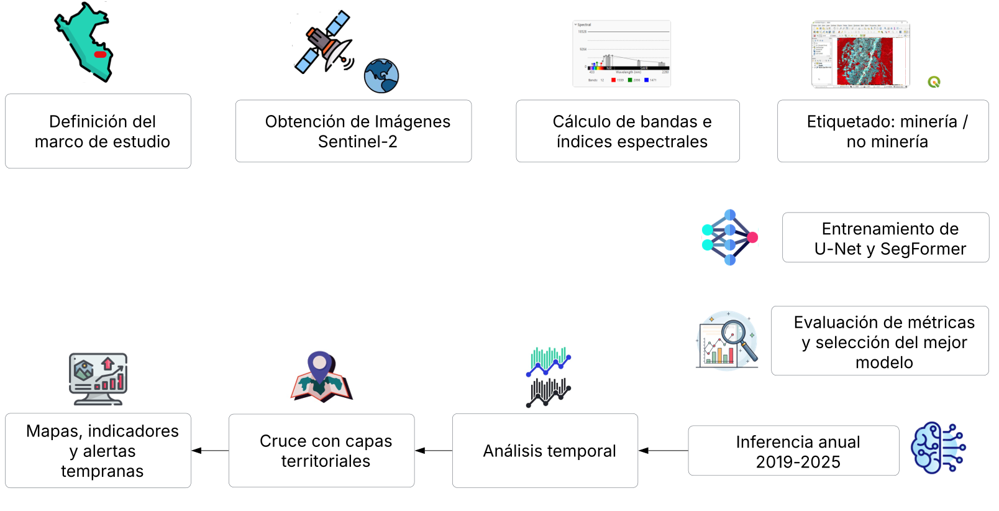
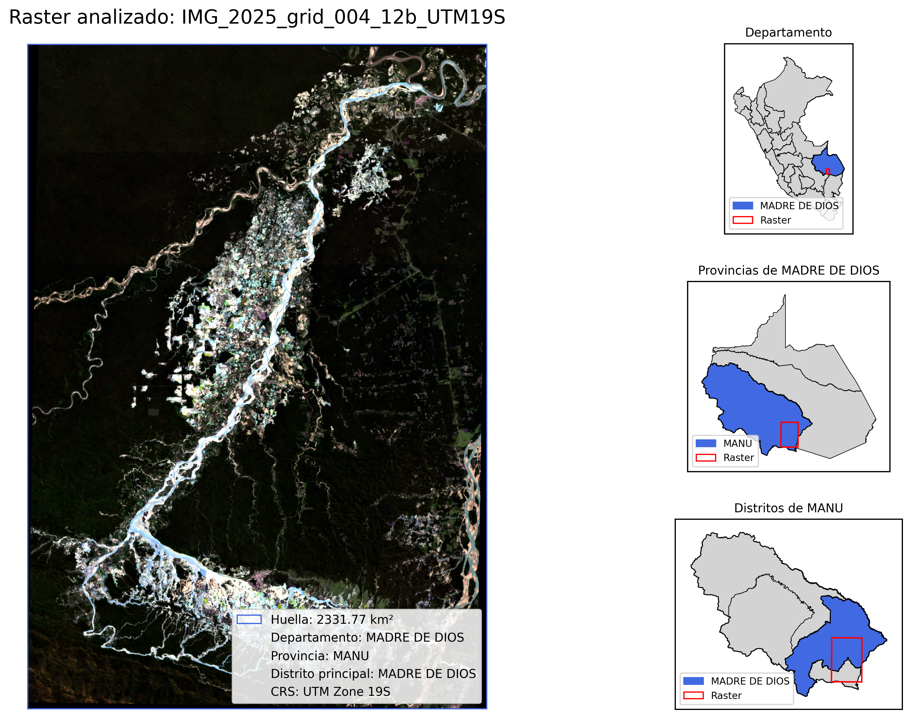
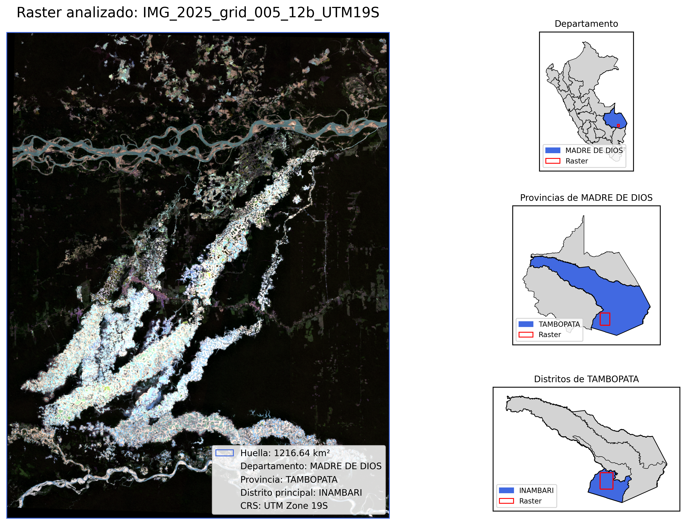
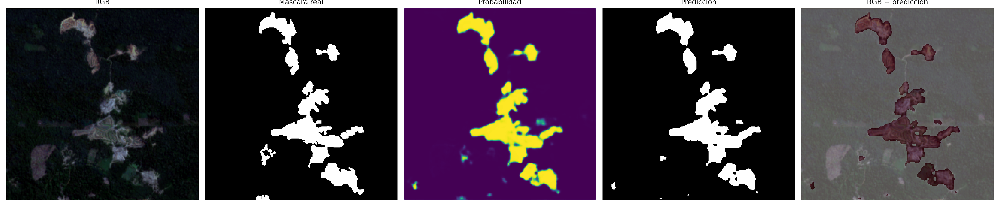
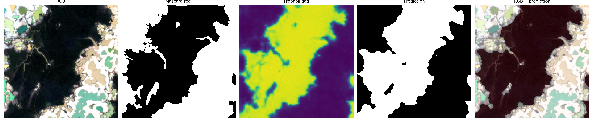
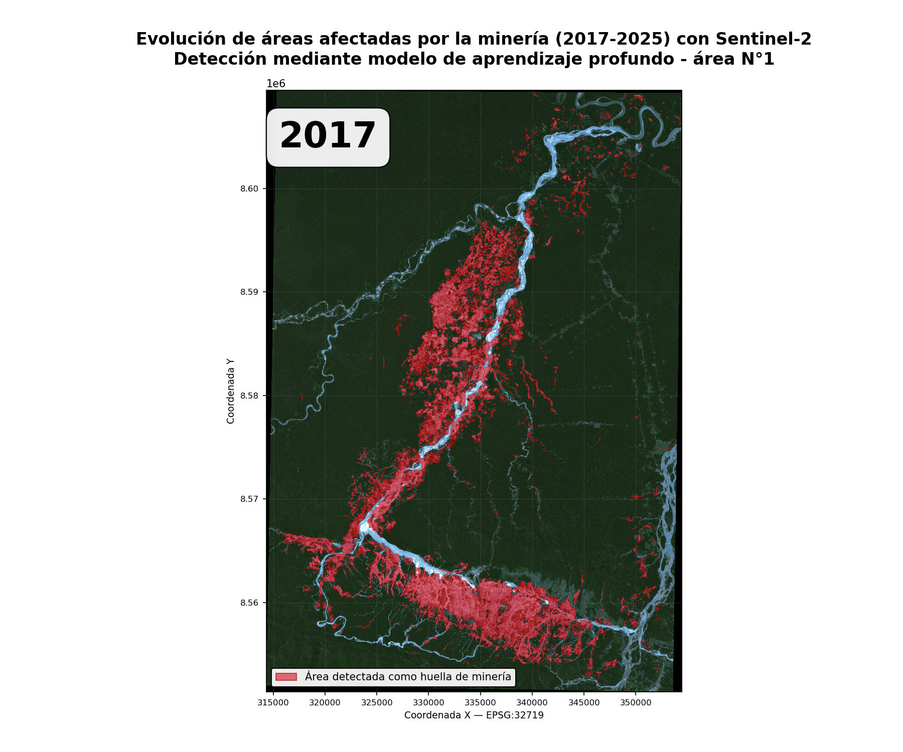
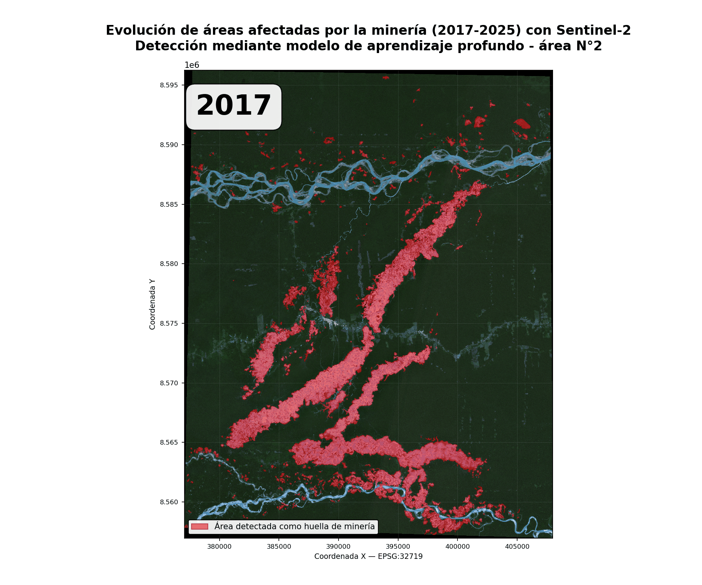

# 🌎 Modelos de inteligencia artificial para la detección y monitoreo multitemporal de minería ilegal: caso aplicado en Madre de Dios

Proyecto de **inteligencia artificial, teledetección y análisis geoespacial** para detectar y monitorear la expansión de la minería ilegal usando imágenes Sentinel-2, modelos Deep Learning y datos territoriales.

El caso piloto se desarrolla en **Madre de Dios** en la provincia de **Manu**, distrito de **Madre de Dios**, con un área aproximada de **2331.77 km²** y la provincia del **Tambopata**, distrito de **Inambari**, con un área aproximada de **1216.64 km²**. La metodología tiene potencial de **escalabilidad a nivel nacional**.

---

## 🚀 Objetivo

Explorar modelos de Deep Learning para detectar, cuantificar y monitorear la degradación del medio donde hay presencia de minería ilegal entre **2017 y 2025**, generando información territorial útil para fiscalización ambiental, alertas tempranas y toma de decisiones públicas.

---

## ⚙️ Flujo metodológico

  

---

## 📍 Área de estudio
| Identificador | Región / Departamento | Provincia | Distrito | Área Aproximada (km²) |
| :--- | :--- | :--- | :--- | :--- |
| **Área 1** | Madre de Dios | Manu | Madre de Dios | 2331.77 |
| **Área 2** | Madre de Dios | Tambopata | Inambari | 1216.64 |

*Nota: La metodología empleada en este caso piloto cuenta con potencial de escalabilidad a nivel nacional.*

### Imagen Sentinel-2

  

  

---

## 🛰️ Datos utilizados

### Imágenes satelitales

- Sentinel-2
- Periodo: 2017–2025
- Meses priorizados: agosto a octubre

### 🛠️ Insumos y Capas del Sistema

| 🛰️ Bandas (Sentinel-2) | 📈 Índices Espectrales | 🗺️ Capas Territoriales |
| :--- | :--- | :--- |
| **B2** (Azul) | **NDVI** (Vegetación) | Límites administrativos |
| **B3** (Verde) | **NDWI** (Agua) | Áreas naturales protegidas (ANP) |
| **B4** (Rojo) | **MNDWI** (Agua modificado) | Zonas de amortiguamiento |
| **B8** (NIR) | **NBR** (Quemas/Severidad) | Comunidades nativas tituladas |
| **B11** (SWIR 1) | **NDBI** (Áreas Construidas) | Ríos navegables |
| **B12** (SWIR 2) | **BSI** (Suelo Desnudo) | Interoperabilidad GEO Perú / SNIG |

---

## 🧠 Modelos entrenados

| Modelo | Descripción |
|---|---|
| U-Net baseline | Encoder ResNet34, 12 canales de entrada |
| SegFormer-B0 | Modelo principal, adaptado a 12 canales Sentinel-2 + índices |

---

## 📊 Resultados del modelo

| Modelo | IoU | Dice/F1 | Precisión | Recall | Accuracy |
|---|---:|---:|---:|---:|---:|
| U-Net baseline | 0.8574 | 0.9090 | 0.9240 | 0.9189 | 0.9742 |
| SegFormer-B0 | 0.8603 | 0.9115 | 0.9119 | 0.9266 | 0.9756 |

**U-Net: Validación Visual**

  

**SegFormer-B0: Validación Visual**

  

**SegFormer-B0** fue seleccionado como modelo principal por su mejor desempeño global.

---

## 📈 Resultados temporales

### Evolución anual de la minería detectada (ha)

| Año | Área 1: Manu (ha) | Área 2: Tambopata (ha) |
|---|---:|---:|
| **2017** | 21757.65 | 13218.71 |
| **2019** | 24126.41 | 16660.04 |
| **2020** | 25610.80 | 17530.30 |
| **2021** | 29118.31 | 18959.10 |
| **2022** | 29402.15 | 20218.14 |
| **2023** | 30370.67 | 22080.18 |
| **2024** | 31450.12 | 24803.03 |
| **2025** | 32739.19 | 28138.03 |

### Indicadores principales

#### **Área 1: Manu (Distrito Madre de Dios)**
- Incremento neto total (2017–2025): **10,981.54 ha**
- Variación total del periodo: **50.47%**
- Expansión nueva (frentes nuevos): **16,721.48 ha**
- Minería persistente (núcleos estables): **16,017.71 ha**
- Huella acumulada multitemporal: **45,548.78 ha**

#### **Área 2: Tambopata (Distrito Inambari)**
- Incremento neto total (2017–2025): **14,919.32 ha**
- Variación total del periodo: **112.87%**
- Expansión nueva (frentes nuevos): **16,241.14 ha**
- Minería persistente (núcleos estables): **11,896.89 ha**
- Huella acumulada multitemporal: **32,299.94 ha**

### 🎞️ Evolución temporal de la minería detectada

  

  

---

## 🗺️ Hallazgos territoriales

### 📍 Análisis territorial - Área 1 (Manu)

| Capa territorial | Expansión Nueva (ha) | Minería Acumulada (ha) | Impactos Principales / Unidades Críticas |
|---|---:|---:|---|
| **Zonas de amortiguamiento** | 5367.60 | 13838.28 | Fuerte afectación y presión sobre la Zona de Amortiguamiento de **Amarakaeri** (5,367.60 ha). |
| **Comunidades nativas** | 5228.18 | 12045.21 | Invasión crítica de tierras indígenas, destacando **San José de Karene** (3,192.13 ha), **Barranco Chico** (1,350.42 ha) y **Puerto Luz** (466.59 ha). |
| **Ríos navegables** | 442.10 | 1564.11 | Alta actividad en los cursos hídricos, liderada por el **Río Puquiri** (197.99 ha), **Río Colorado** (94.72 ha) y **Río Caychihua** (68.39 ha). |
| **Áreas naturales protegidas** | 0.00 | 1.96 | No se registraron nuevos frentes dentro de ANP nucleares, mostrando una desestimación/reducción de 1.95 ha en el periodo. |

### 📍 Análisis territorial - Área 2 (Tambopata)

| Capa territorial | Expansión Nueva (ha) | Minería Acumulada (ha) | Impactos Principales / Unidades Críticas |
|---|---:|---:|---|
| **Zonas de amortiguamiento** | 7330.63 | 16756.43 | Presión masiva en la Zona de Amortiguamiento de **Tambopata** con un crecimiento dinámico de 7,330.63 ha. |
| **Comunidades nativas** | 232.12 | 308.43 | Impacto focalizado directamente sobre el territorio de la comunidad nativa de **Kotsimba** (232.12 ha). |
| **Ríos navegables** | 164.22 | 432.32 | Degradación en márgenes y llanuras fluviales, principalmente en el **Río Inambari** (87.75 ha) y **Río Manuani** (64.49 ha). |
| **Áreas naturales protegidas** | 25.66 | 723.11 | **Alerta crítica:** Detección de frentes activos y una expansión de **25.66 ha** directamente al interior del **Área Natural Protegida Tambopata**. |

---

## 🌐 Escalabilidad

Aunque el piloto se desarrolló en Madre de Dios, la metodología puede escalarse a otras regiones del Perú afectadas por minería ilegal, deforestación o degradación ambiental. 

Para escalar el sistema se requiere:
* **Incorporar nuevas imágenes** provenientes de satélites como Sentinel-2.
* **Generar muestras locales** de entrenamiento adaptadas a la geografía de cada zona.
* **Ajustar o reentrenar el modelo** para asegurar una alta precisión.
* **Integrar capas territoriales** regionales para un mejor contexto geográfico.
* **Automatizar reportes** y la emisión de alertas tempranas.

---

## 🎯 Impacto Esperado

Este proyecto busca contribuir a:
* 🔍 **Mejorar la fiscalización ambiental** a través de tecnología precisa.
* 🚨 **Detectar nuevos frentes** de minería ilegal de manera temprana.
* 🌿 **Reducir riesgos socioambientales** asociados a la degradación del territorio.
* 📍 **Priorizar zonas críticas** para la intervención y control.
* 📊 **Fortalecer la toma de decisiones** en la gestión pública basadas en evidencia.
* 🏛️ **Impulsar la transformación digital** de las instituciones del Estado.

---
